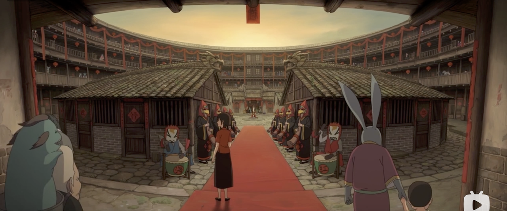
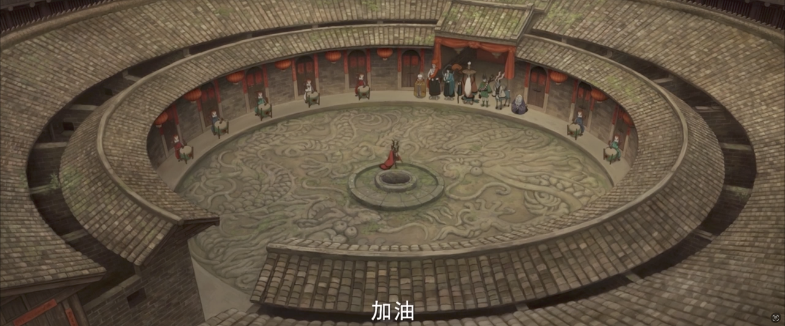
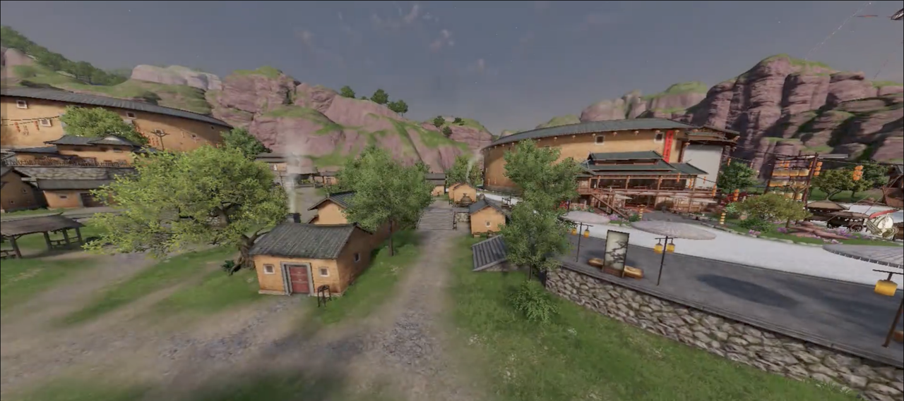
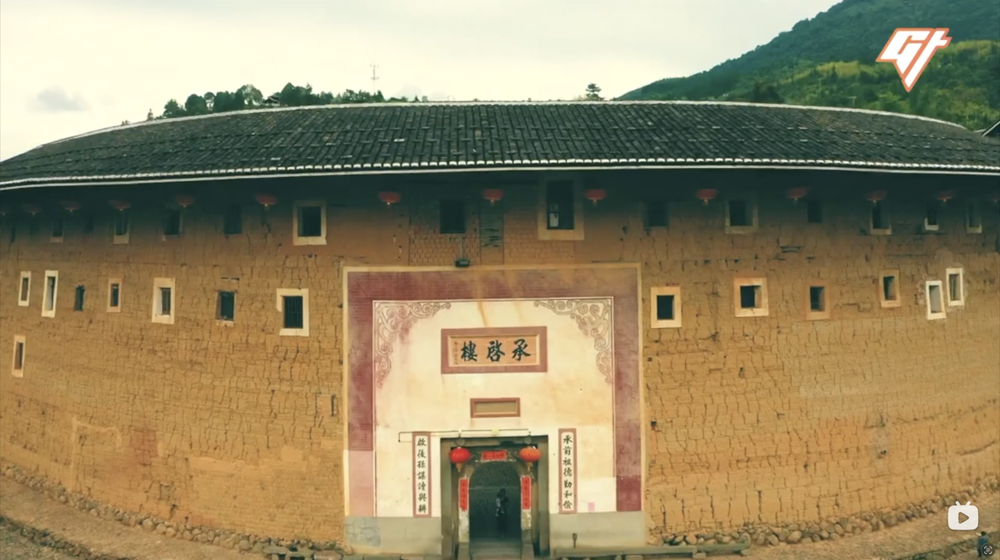
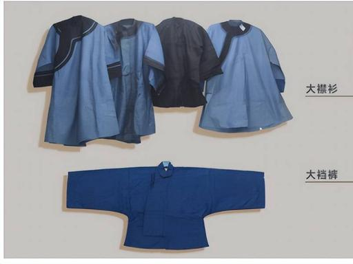
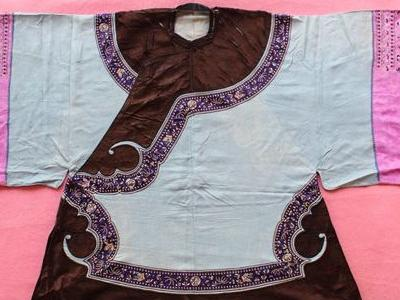
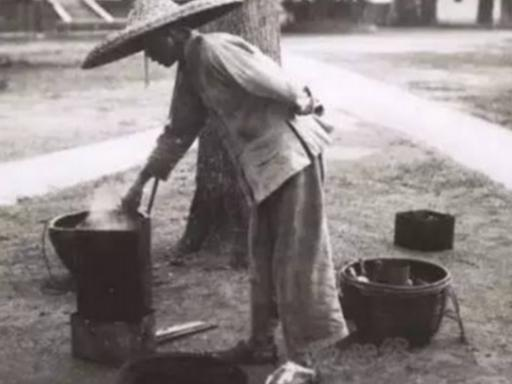
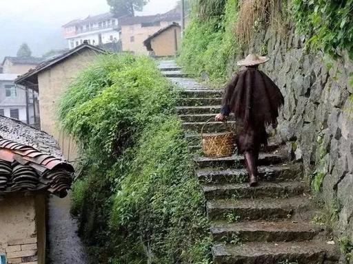
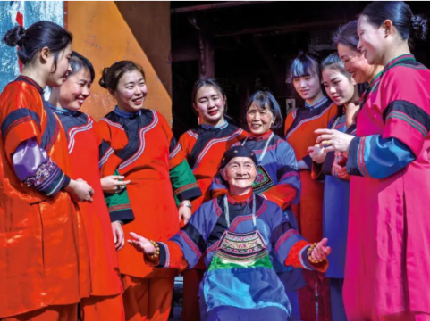

# 《客批》美术风格设定 v1

## 一、场景美术风格

### 1. 参考

| **含土楼元素的影视/游戏作品汇总表** |          |                                                                                                      |                                                                                                 |                                        |
| -------------------- | -------- | ---------------------------------------------------------------------------------------------------- | ----------------------------------------------------------------------------------------------- | -------------------------------------- |
| **作品名称**             | **作品类型** | **作品截图**                                                                                             | **土楼设定内容**                                                                                      | **整体美术风格**                             |
| 大鱼海棠                 | 国产奇幻动画电影 |  | 核心世界观舞台完全基于南靖、永定土楼改造；提取圆楼同心圆、通天天井、环形回廊核心造型，放大奇幻浮空、海天倒置设定，土楼是灵界族群完整家园。                      | 东方奇幻水彩；写意化改造土楼，弱化现实夯土粗糙感，加入云海、浮空等魔幻元素  |
| 天涯明月刀                | 武侠MMO手游  |                                                    | 与福建永定土楼非遗深度联动，游戏地图1:1还原环兴楼圆土楼；线下改造真实510年环兴楼打造沉浸式剧场、主题民宿，融入客家十番音乐、采善堂制茶、客家宴席等非遗剧情，配套专属主题曲《天地吾乡》。 | 写实国风武侠；传统夯土建筑+江湖武侠、现代电竞潮流融合，偏向写实还原土楼结构 |
| 桃源深处有人家              | 国风模拟经营手游 | *(截图待补：`assets/kepi_art-style-ref-taoyuan-deep.png`)*                                                   | 联动永定土楼，复刻“土楼王子”振成楼专属家园建筑皮肤；上线舞火龙、客家庙会、客家农耕等限定休闲玩法，玩家可自建土楼庭院体验客家日常民俗。                       | 治愈水墨Q版国风；轻量化简化土楼结构，弱化厚重夯土质感，突出田园烟火柔和氛围 |
| 花木兰                  | 好莱坞真人电影  |                                                    | 影片女主木兰的故乡取景福建华安二宜楼（圆形土楼），将土楼作为北方中原家族聚居宅邸，用巨型环形夯土建筑塑造东方神秘家族堡垒形象，内外完整还原土楼回廊、中庭祖堂结构。               | 史诗东方写实；宏大宽幅自然风光，西式电影镜头结合传统客家建筑，史诗厚重感   |

### 2. 场景美术风格设定

**主锚点**：《大鱼海棠》—— 东方奇幻水彩、写意土楼、暖色逆光、不写实不 3D。

**土楼识别**：圆形土楼为绝对主视觉；同心圆回廊 + 通天天井 + 木质内廊，三阶段（破败 / 修缮 / 翻新）通过墙体、屋顶、灯火密度区分。

**色彩**：

- 场景主色：暖木褐、靛蓝点缀、柔和天光
- 我军：蓝靛土布、温润人情
- 敌军：青灰 + 朱红（官印 / 火 / 船红），冷硬压迫

**镜头与构图**：棋盘横向宽画幅；立绘半身、角色居中、背景虚化；结局层可加强风浪与海面过场。

**明确不做**：写实 3D、西式史诗厚重（参考花木兰但非主风格）、Q 版治愈（桃源仅作结构简化参考）。

**参考锚点文件**（`docs/assets/`）：

| 锚点 | 文件 | 用途 |
|---|---|---|
| 主风格 | `kepi_art-style-ref-big-fish-begonia-1.png` / `-2.png` | 人物与场景水彩基调 |
| 土楼结构 | `kepi_art-style-ref-moonlight-blade.png` | 圆楼 1:1 结构感 |
| 史诗构图 | `kepi_art-style-ref-mulan.png` | 宽幅家族堡垒构图（次要） |
| 服饰基础 | `kepi_art-style-hakka-base-shirt-pants.jpg` | 客家基础衫裤 |

出图 prompt 详见 [素材与媒体计划 v1 §2.2](kepi_assets-and-media-plan_v1.md#22-棋子与敌人立绘)。

## **二、人物风格**

### 传统客家服饰总基础特征

整体承袭中原汉服右衽宽身风格，简朴实用、不尚浮华，主色为蓝、黑、灰靛染土布；核心标配：大襟斜襟衫、宽腰深裆大裆裤，版型全宽松，适配山地劳作；布制盘扣为主，少繁复刺绣，仅女性围裙、领口镶少量彩边；面料多用自织苎麻、棉布，耐磨耐脏，分族长、风水先生、农民、村寨守卫四类专属装束，区分清晰：

客家基础衫裤

传统大襟蓝衫

#### 一、客家族长（宗族主事、长辈乡绅）服饰特点

族长是围屋宗族最高权威，服饰重庄重礼制、体面内敛，分日常款、宗族大典礼服两类：

1. 上衣

   * 大典穿及踝长款黑 / 藏青大襟长袍（长衫），直领右衽、超大宽袖，5 颗整齐黑布盘扣，面料选用厚实土棉布或绸缎（富裕族长），无花哨绣纹，仅衣襟、袖口窄幅黑缎镶边；

   * 日常议事穿中长款大襟蓝衫，衣长过膝，版型宽松，方便落座主持族会。

2. 下装：深色加厚大裆裤，裤腰加宽双层布，系带为黑棉长带，垂于身前显稳重。

3. 头部配饰 正式场合戴黑色布制四方瓜皮帽；平日不戴帽，头发整齐束起，年长族长多蓄短须。

4. 鞋袜与细节 脚穿黑布圆口软底布鞋，配白布长筒袜；腰间系深色素面布腰带，可挂宗族账本、木印章；全身极少金银装饰，仅手腕可戴素面玉镯，体现客家 “重德不重奢” 规矩。

5. 核心识别点：长款素色长袍、瓜皮帽、全身上下无艳色花纹，气质肃穆，和普通村民短衫形成明显区分。

#### 二、客家风水先生（地理师、阴阳先生）服饰特点

结合客家本土习俗 + 传统道袍形制，服饰自带阴阳玄学标识，上山寻龙、办红白法事分两套穿搭：

1. 日常下乡看地常服 内层穿客家基础蓝布对襟短衫，外搭一件青蓝色宽松道褂（短款道袍，长度到小腿），大襟宽袖，衣身干净素色；下装深色大裆裤，方便翻山越岭。

2. 祭祖、丧葬、选址仪式礼服 外穿及足长青色道袍（得罗），对襟大袖，衣身绣标准道教纹样：前胸后背太极阴阳鱼、双肩乾坤八卦，袖口、下摆点缀日月星辰暗纹；面料轻薄麻布，行走飘逸。

3. 专属配饰（辨识度最高）

   * 头部：黑色混元道巾（圆顶硬布道帽），出门上山会叠加竹编素面斗笠；

   * 随身：腰间挂罗盘布袋、桃木尺；脚穿十方青布鞋，鞋面缝十道白布条；

   * 雨天外披轻便棕蓑衣，不花哨，兼顾风水身份与山地实用。

4. 色彩规律：以青、黑为主，极少大红大紫，青色象征天道阴阳，区别于村民纯劳作蓝衣。

#### 三、客家农民（耕田、砍柴、务农男女）服饰特点

一切为劳作服务，极简耐磨，是客家最普及基础装束：

#### 男性农民

1. 上衣：短款对襟短衫（干活最方便），靛蓝、灰黑土麻布，前中开襟、一排布扣，下摆开叉方便抬腿插秧、挑担；夏季单麻衫，冬季夹棉短袄。

2. 下装：超大裆大裆裤，裤腰宽大可折叠，一根粗布腰带系紧，裤腿直筒，下水、上山无束缚。

3. 防护穿戴：上山戴竹编客家凉帽（竹篾编织，一圈黑布垂帘遮阳）；雨天披棕皮蓑衣、戴竹笠麻；赤脚或穿稻草草鞋，农闲穿粗布木底布鞋。

务农男子装束

蓑衣斗笠劳作服

#### 女性农民

1. 上衣：斜襟大襟短蓝衫，袖口窄彩条镶边；身前必罩彩色围裙（水裙），红、绿、蓝条纹布，防泥土弄脏内衫；

2. 头部标志性：冬头帕（长条彩纹布头巾），包裹头部遮挡日晒风寒；已婚妇女盘船子髻，插简易银簪；

3. 下装七分大裆裤，脚踝用红布条捆扎；日常多赤脚，仅赶集穿绣花软布鞋。

#### 整体识别：短上衣、粗麻布、配套蓑衣凉帽，满身便于农活，装饰极少。

客家农妇传统蓝衫

#### 四、客家围屋守卫（村寨护院、碉楼值守）服饰特点

分日常巡逻便装、防御值守戎装，兼顾客家布衣底色与防卫实用性：

1. 日常巡逻便装（和农民基础款相近，但有区分标识） 深蓝加厚对襟短衫，面料为耐磨粗帆布，袖口、肩头双层补丁加固；深色厚款大裆裤，裤脚收紧，防止山林蚊虫、碎石划伤；腰间加宽厚布腰带，可插柴刀、短棍。

2. 战时 / 碉楼值守戎装 短衫外穿无袖粗棉坎肩（护心背心），多层棉布缝制，抵御棍棒、石块；部分富裕围屋守卫会搭配简易竹片肩甲；

3. 头部与足部 常年戴加厚竹编斗笠，帽檐加宽挡箭、挡石块；脚穿厚底桐油布鞋，防滑防刺；夜间值守会裹黑布头巾，便于隐蔽。

4. 专属识别细节 衣服侧边缝一小块红色方布标记（村寨守卫统一标识，区分普通村民）；随身搭配扁担、长矛、柴刀，服饰版型紧凑，不会宽松拖沓影响跑动、登碉楼。

#### 四类服饰快速区分总结

1. 族长：长款素色长袍、瓜皮帽，庄重无装饰，宗族仪式专用；

2. 风水先生：青灰道袍、道巾、衣身太极八卦纹样，自带玄学符号；

3. 农民：短款粗麻衫、蓑衣凉帽、围裙 / 头帕，全为农耕劳作设计；

4. 守卫：加厚耐磨短衫、棉坎肩、红衣标，版型利落方便奔跑防御。

### 客批的人物风格设计

#### 一、我军棋子造型设定(7个)

1. **农夫(1费 · 男性农民)**

* 气质:精瘦黝黑的青壮劳力,憨厚。

* 头部:竹编客家凉帽(竹篾编织,一圈黑布垂帘遮阳)。

* 上衣:短款对襟短衫,靛蓝土麻布,前中一排布扣,下摆开叉。

* 下装:超大裆大裆裤,粗布腰带系紧,直筒裤腿。

* 足部:赤脚或稻草草鞋。

* 手持:锄头/扁担(呼应"产金币=耕作产出)。

* 识别点:凉帽+短对襟衫+大裆裤,满身劳作感、装饰极少。

* 考据:图2"务农男子装束";资料三·男性农民。

- **围屋守卫(2费 · 村寨护院)**

* 气质:壮实警觉,站如桩。

* 头部:加厚竹编斗笠(帽檐加宽,挡石块),夜间款裹黑布头巾。

* 上衣:深蓝加厚对襟短衫(耐磨粗帆布,袖口肩头双层补丁),外穿无袖粗棉坎肩(护心背心),富裕款加竹片肩甲。

* 下装:深色厚款大裆裤,裤脚收紧。

* 足部:厚底桐油布鞋。

* 手持:长矛/柴刀/扁担。

* 识别点(关键):**衣服侧边缝一小块红色方布标记**——这是守卫区别于普通村民的统一标识,务必画出。版型紧凑利落。

* 考据:资料四·围屋守卫。

- **水客(2.5档 · 公益后勤位 · 收信人)**

* 气质:风尘仆仆但可靠温和的行脚信使,中年。

* 头部:竹编斗笠(挡风雨,与守卫斗笠区分:更轻便、无加厚)。

* 上衣:大襟蓝衫(比农民整洁,因常进城办事),外可搭轻便棕蓑衣(行路风雨)。

* 下装:大裆裤,绑腿(便于长途跋涉)。

* 足部:粗布木底布鞋(走远路)。

* 手持(关键):**一根扁担挑两个箩筐/信袋**,腰挂装书信银元的褡裢——这是"挑担收信"动效的形象本体。

* 识别点:挑担+斗笠+褡裢,行路人姿态。区别于农夫:更整洁、负行囊而非农具。

* 考据:就近取形于图2右"蓑衣斗笠劳作服"的行路人;水客=客批传递者史实。

- **教书先生(3费 · 武力辅)**

* 气质:清癯斯文的读书人,中年儒雅。

* 头部:头发整齐束起,可戴文人方巾(非族长瓜皮帽,区分),蓄短须。

* 上衣:中长款大襟蓝衫(长衫,比农民长、比族长短素),袖稍宽,干净无补丁。

* 下装:大裆裤,素色。

* 足部:黑布圆口软底布鞋。

* 手持:书卷/戒尺(呼应"耕读传家之读"、攻速增益=授业提效)。

* 识别点:长衫+文人巾+书卷,介于平民短衫与族长长袍之间——地位中等的读书人。

* 考据:资料"耕读传家之读";长衫形制参照族长日常蓝衫的简化。

- **乡贤(3.5档 · 公益后勤位 · 修家园)**

* 气质:体面温厚的返乡建设者,中老年,有威望但不及族长肃穆。

* 头部:头发束起,可戴瓜皮帽(比族长的旧/简,或不戴),蓄须。

* 上衣:中长款大襟蓝衫/藏青衫,衣长过膝,版型宽松体面,窄幅素镶边(比族长少、比平民多)。

* 下装:深色大裆裤,黑棉长带。

* 足部:黑布圆口软底布鞋,配白布袜。

* 手持:可持修缮图纸/算盘/卷尺(呼应"用桑梓值修家园"),或拄文明杖。

* 识别点:体面长衫但不及族长的及踝长袍庄重——"成功返乡、回馈桑梓"的乡绅气质。背景flavor:当年的支教青年成了乡贤。

* 考据:族长装束的"降一档"简化;梅州侨乡乡贤反哺史实。

- **风水先生(4费 · 武力策略)**

* 气质:清瘦神秘的阴阳地理师,目光深邃。

* 头部(辨识度最高):黑色混元道巾(圆顶硬布道帽),上山叠加竹编素面斗笠。

* 上衣:内层客家蓝布对襟短衫,外搭青蓝色宽松道褂(短款道袍,到小腿),大襟宽袖;仪式款为及足青色道袍,绣**太极阴阳鱼(前胸后背)、乾坤八卦(双肩)、日月星辰暗纹(袖口下摆)**。

* 下装:深色大裆裤;仪式款道袍盖至足。

* 足部:十方青布鞋(鞋面缝十道白布条);雨天披棕蓑衣。

* 手持:**罗盘 + 桃木尺**(腰挂罗盘布袋)。

* 识别点:道巾+八卦太极纹+罗盘,青黑配色,自带玄学符号,一眼区别于村民蓝衣。

* 考据:资料二·风水先生(辨识度最高的一类)。

- **族长(5费 · 武力核心)**

* 气质:威严肃穆的宗族最高权威,年长。

* 头部:**黑色布制四方瓜皮帽**(正式场合);蓄短须,头发整齐束起。

* 上衣:及踝长款黑/藏青大襟长袍(长衫),直领右衽、**超大宽袖**,**5颗整齐黑布盘扣**,厚土棉或绸缎,衣襟袖口窄幅黑缎镶边,无花纹。

* 下装:深色加厚大裆裤,裤腰双层加宽,黑棉长带垂于身前显稳重。

* 足部:黑布圆口软底布鞋,配白布长筒袜。

* 手持:可拄手杖,腰间挂宗族账本/木印章;手腕素面玉镯。

* 识别点(关键):**长款素色长袍+瓜皮帽+全身无艳色花纹**,气质肃穆,与所有村民短衫形成最强对比——一眼即知"全村最高地位"。重德不重奢。

* 考据:资料一·族长。

> **地位视觉梯度(务必做出层次)**:农夫/守卫=短衫(劳作层)→ 水客=挑担蓝衫(行脚层)→ 教书先生/乡贤=中长蓝衫(体面层)→ 风水先生=道袍(玄学层)→ 族长=及踝黑长袍+瓜皮帽(权威顶层)。衣长越长、颜色越素、装饰越克制=地位越高,这是客家"重德不重奢"的视觉语言。

***

#### 二、遗忘军团造型设定(6个敌人)

原则:**物变人/人变物**,一眼看懂"这是阻挡客家人回乡、造成遗忘的东西";与我军拉开异质感(器物成精的诡异、冷硬,对比我军的人情温度)。

* **迁海碑(禁海碑)**

- 本体:明清海禁界碑成精。一块长了细长官腿的青灰石碑,碑身盖满朱红官印、刻发光禁海令文,顶部似官帽。行走时石腿僵硬、碑面渗红光镇压。气质:官僚的冷酷压迫。

* **路引关吏**

- 本体:关卡门神/差役成精。戴歪斜官帽、举"路引"令牌的纸糊差役,身形如关卡门板,脸是一张盖了"验讫"印的公文。拦路查票的姿态,手伸出索要路引。

* **猪仔契**

- 本体:卖身契卷轴成精。一卷活过来的泛黄契约,卷轴化作锁链缠绕人形,链上挂矿场镐头、橡胶园符号。契约文字爬满全身如纹身,挣不脱的束缚感。

* **饿虎山**

- 本体:拟人化山岭。一座有獠牙血口的群山怪,身覆枯黄败田、嶙峋怪石,张口如山谷吞人,挡在归途。代表"八山一水一分田"的故土无生路。

* **红头船(天价归船)**

- 本体:拟人化红头船。一艘船头涂红的木帆船成精,船身贴满天价船票、银元符号,横在归途索买路钱;船帆是一张张账单。气质:贪婪的经济墙——付不起就过不去。

* **械斗火**

- 本体:持械的火怪。一团有手脚的火焰,手持锄头镰刀(土客械斗的农具武器),火中浮现争斗的影子。代表回乡怕报复排挤的乱世之火。

> **敌军统一视觉语言**:冷硬、诡异、器物质感(石/纸/契约/账单/火),色调偏青灰+朱红(官印/火/船红)的压迫色,与我军温暖的蓝靛土布人情味形成对比。每个敌人身上都带"它阻挡归乡的那个历史符号"(官印、路引、锁链、枯田、船票、械斗农具)。

### 出人物角色的 prompt

### 通用风格基底(每个 prompt 前面都加这段)

**中文版(即梦/可灵用):**

> 《大鱼海棠》风格,温润写意的国风手绘水彩,2D动画赛璐璐上色,柔和的手绘笔触,暖色调氛围光,木质围屋室内的温暖逆光,质感细腻不写实不3D,人物面部柔和、眼神温润有神,线条干净流畅,整体气质宁静、有东方诗意和年代感,半身立绘,纯色或虚化背景,角色居中

**英文版(MJ用):**

> in the art style of Chinese animated film "Big Fish & Begonia", warm painterly 2D cel-shaded illustration, soft hand-drawn watercolor texture, gentle warm ambient lighting, traditional Hakka roundhouse wooden interior with warm backlight, serene poetic East-Asian mood, clean flowing linework, soft tender facial features with luminous eyes, character portrait half-body, simple blurred background, --ar 3:4 --niji 6
>
> **关键提示**:出图时把上面这段放最前面,接下来贴某一个角色的描述。`--niji 6` 是 MJ 里最接近这种日系/国风动画感的参数;即梦/可灵直接用中文版即可。

***

### 我军 7 个棋子 prompt

1. **农夫(1费)**

> 一位精瘦黝黑、憨厚的客家青壮年男性农民,头戴竹篾编织的客家凉帽(帽檐垂一圈黑布遮阳),身穿靛蓝色土麻布短款对襟短衫(前襟一排布盘扣、下摆开叉),下穿宽松靛蓝大裆裤、粗布腰带,赤脚或穿稻草草鞋,肩扛一把锄头或挑着扁担,朴实劳作的姿态

* **围屋守卫(2费)**

> 一位壮实警觉的客家村寨守卫男性,头戴宽檐加厚竹编斗笠,身穿深蓝色耐磨粗布对襟短衫(袖口与肩头有双层补丁),外罩多层棉布缝制的无袖护心坎肩,**衣服侧边缝一小块红色方布作为守卫标识**,深色收紧脚口的大裆裤,厚底布鞋,手持长矛或柴刀,站姿挺拔利落

* **水客(2.5档)**

> 一位风尘仆仆但温和可靠的客家中年信使(水客),头戴轻便竹编斗笠,身穿整洁的靛蓝大襟斜襟长衫(右衽布盘扣),小腿打绑腿,肩上用一根扁担挑着两个装书信和银元的箩筐/褡裢,行路人的姿态,神情温厚带着远行的疲惫

* **教书先生(3费)**

> 一位清癯斯文的客家中年读书人(教书先生),头发整齐束起、戴素色文人方巾、蓄短须,身穿干净素雅的靛蓝色中长款大襟长衫(右衽、衣长及膝、袖略宽、无补丁),深色大裆裤,黑布圆口软底鞋,手持一卷书或一支戒尺,儒雅温和

* **乡贤(3.5档)**

> 一位体面温厚、有威望的客家中老年返乡乡绅(乡贤),头发束起、蓄须、戴半旧瓜皮帽,身穿藏青色中长款大襟长衫(衣长过膝、窄幅素色镶边,比普通村民体面、但不及族长庄重),深色大裆裤系黑棉长带,黑布软底鞋配白布袜,手持修缮图纸或拄文明杖,神情慈和睿智

* **风水先生(4费)**

> 一位清瘦神秘的客家阴阳地理师(风水先生),头戴黑色圆顶硬布混元道巾(可叠戴竹编素面斗笠),身穿青蓝色宽松道袍(对襟大袖、衣长及小腿),**道袍前胸后背绣太极阴阳鱼、双肩绣乾坤八卦、袖口下摆点缀日月星辰暗纹**,青黑配色,腰间挂罗盘布袋与桃木尺,手持罗盘,神情深邃带玄学气

* **族长(5费)**

> 一位威严肃穆、年长的客家宗族族长,头戴**黑色四方瓜皮帽**、蓄短须、头发整齐束起,身穿及踝的黑色或藏青色大襟长袍(直领右衽、超大宽袖、**五颗整齐黑布盘扣**、衣襟与袖口窄幅黑缎镶边、全身无花纹),深色加厚大裆裤系黑棉长带,黑布圆口软底鞋配白布长筒袜,手腕戴素面玉镯、可拄手杖,气质庄重不怒自威

***

### 遗忘军团 6 个敌人 prompt

敌人我在通用风格基底后,**额外加一句异质感提示**:`色调偏冷硬青灰与朱红,器物成精的诡异感,与人物角色的温暖人情味形成对比,反派氛围` —— 这样敌人和我军同画风但能一眼区分。

* **迁海碑(禁海碑)**

> 一块明清海禁界碑成精的怪物,青灰色石碑碑身、表面盖满朱红色官府印章与发光的禁海令刻字,碑顶形似官帽,碑身下方长出两条僵硬细长的石腿在行走,冷酷压迫的官僚气

* **路引关吏**

> 一个关卡差役/门神成精的怪物,身形像一块僵硬的关卡门板,戴歪斜官帽、举着写有"路引"的木质令牌,脸是一张盖了红色"验讫"官印的公文,伸手作拦路查票的姿态,刻板冷硬

* **猪仔契**

> 一卷泛黄的卖身契(猪仔契)成精的怪物,活过来的契约卷轴化作锁链缠绕成人形,锁链上挂着矿场镐头与橡胶园符号,契约黑色文字爬满全身如纹身,被束缚挣不脱的痛苦感

* **饿虎山**

> 一座拟人化的群山怪物,山岭张开有獠牙的血盆大口形似山谷,山体覆盖枯黄的败田与嶙峋怪石,荒芜贫瘠,阻挡在归途上的压迫巨兽感

* **红头船(天价归船)**

> 一艘拟人化的红头木帆船怪物(船头涂红),船身贴满天价船票与银元符号,船帆是一张张账单,横挡在归途上伸手索要买路钱的姿态,贪婪的经济壁垒感

* **械斗火**

> 一团拟人化的火焰怪物,火焰长出手脚,手持锄头与镰刀等农具武器,火苗中浮现土客械斗争斗的影子,暴烈混乱、代表乱世报复的危险感

***

出图建议:**先出族长和风水先生**(造型最复杂、最能验证画风);**同一角色多出几张挑**(瓜皮帽、五颗盘扣、八卦纹等细节容易丢);**敌人如果出得太可爱**,在 prompt 里加重"狰狞、压迫、menacing、诡异"等词。
